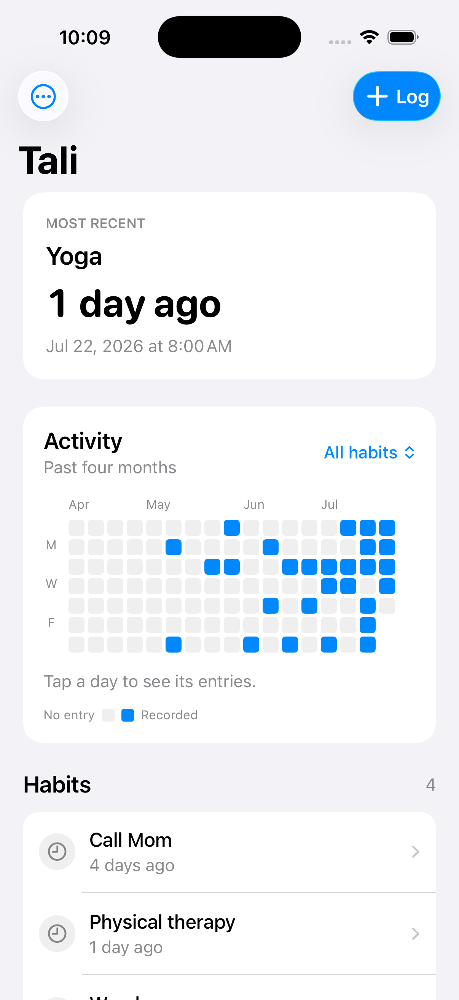
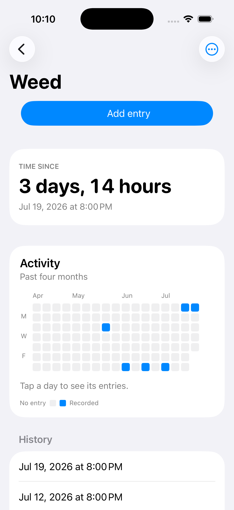

# Tali

[](https://github.com/katswnt/tali/actions/workflows/ci.yml)

**An emotionally neutral activity log you can update by sending a message.**

Tali records what happened and when. It does not decide whether an activity is good or bad, turn repetition into a streak, or recommend what the user should do next.

The working personal alpha includes a native iPhone app, Messages extension, Siri and Shortcuts actions, and an optional SMS service built with Twilio, Cloudflare Workers, and D1. Public SMS onboarding remains closed while the A2P campaign and production safeguards are completed.

## Product tour

<p align="center">
  
  
</p>

These screens use the repository’s isolated, in-memory demo data. They do not contain personal history or contact the SMS service.

## Why Tali exists

Most habit trackers make two assumptions:

1. Logging should happen inside the tracker.
2. More repetition is progress.

The first adds friction to an action that should take seconds. The second breaks down for activities whose desired frequency is personal, contextual, or intentionally undecided.

Tali tests a different model: capture through interfaces the user already knows, then provide a factual record without prescribing a goal.

```text
yoga
yoga yesterday at 7pm
weed sunday 2pm
physical therapy -- shoulder felt better
```

The same deterministic grammar works in the app, Messages, and SMS. Tali stores the timestamp, keeps the history, and updates a binary GitHub-style activity chart.

## Product principles

- **Observe without judging.** Show timestamps, elapsed time, history, counts, and notes without praise, shame, warnings, or recommended frequency.
- **Let the user define the data.** New installs start empty; Tali does not suggest which activities a person should track.
- **Make potentially loaded metrics optional.** Elapsed time can be hidden globally or for one habit.
- **Do not encode “more is better.”** Activity cells indicate whether an entry exists; exact counts appear only when a date is inspected.
- **Preserve the user’s language.** Tali does not classify or euphemize habit names.
- **Keep correction factual.** Undo voids an entry without pretending it never existed.

The complete copy and behavior test is documented in [Tali product principles](docs/product-principles.md).

## Experience

- Log from the iPhone app, Messages extension, Siri, Shortcuts, or SMS.
- Backdate an entry with phrases such as `yesterday at 7pm` or `sunday 2pm`.
- Attach an optional note after `--`.
- Ask `since yoga`, `history yoga`, `habits`, or `undo`.
- Define aliases such as `pt` for `Physical therapy`.
- Inspect four months of binary activity and tap any date for its exact count.
- Hide elapsed time globally or for an individual habit.
- Archive and restore habits without losing history.
- Export active, archived, and voided data as CSV or JSON.

## Architecture

```text
Messages extension ─┐
iPhone app ─────────┼─> SwiftData in an App Group ─┐
Siri + Shortcuts ───┘                              │
                                                  ├─> UUID + updatedAt reconciliation
Sign in with Apple ─> hashed device session ──────┤
SMS -> Twilio -> signed Worker webhook -> D1 ─────┘
```

The native surfaces share a static `HabitCore` framework and one SwiftData schema. Local capture works without an account or network connection.

The optional SMS path verifies Twilio signatures, resolves the sender to an authenticated user, scopes every database operation to that user, and records each Twilio `MessageSid` once. Sign in with Apple sessions are stored in Keychain on-device and only hashed session tokens are stored in D1.

See [Security and sync](docs/security-and-sync.md) for the trust boundaries, conflict model, accepted alpha constraints, and production gates.

## Decisions and tradeoffs

| Decision | Why | Cost accepted at this stage |
| --- | --- | --- |
| Deterministic local parser | Private, fast, inexpensive, predictable, and testable | Smaller grammar than an open-ended language model |
| Local-first capture | Network failure never blocks the core action | SMS updates are synchronized rather than instantly pushed |
| Append-only events | Preserves provenance and makes undo and sync easier to reason about | Queries must consistently exclude voided entries |
| Archive instead of delete | Preserves history and makes the action reversible | True deletion still needs a separate account-data workflow |
| Binary heatmap | Shows occurrence without implying that more is better | Density is available on inspection rather than encoded as intensity |
| Snapshot sync with UUIDs and timestamps | Simple enough to validate the personal alpha across capture surfaces | Last-write-wins depends on client clocks and is not the final large-scale conflict model |
| Sign in with Apple only | Minimizes identity collection and fits the native product | Couples multi-user SMS accounts to Apple identity |
| Native platform controls | Dynamic Type, accessibility behavior, and familiarity come largely for free | The visual system is intentionally quieter than a highly branded custom UI |

## What this project demonstrates

### Product

- Reframing habit tracking around observation rather than behavior change
- Turning a qualitative user discomfort into concrete copy, visualization, and settings rules
- Separating the core interaction from optional infrastructure
- Treating carrier registration, consent, and opt-out behavior as product requirements
- Sequencing a personal alpha before a public multi-user rollout

### Engineering

- Swift 6, SwiftUI, SwiftData, schema migration, and App Group persistence
- Messages extensions, App Intents, Siri, Shortcuts, and Keychain
- Natural-language date parsing without external AI services
- Cloudflare Workers, D1 migrations, and Twilio webhooks
- Sign in with Apple JWT verification and revocable hashed sessions
- Multi-tenant query scoping and short-lived phone-number pairing
- Webhook signature validation, XML escaping, and message idempotency
- Duplicate-safe synchronization and historical identity repair

The longer narrative is in the [product and engineering case study](docs/portfolio-case-study.md).

## Reliability and tests

- **19 Swift tests** cover parsing, aliases, backdating, logging, undo, archive/restore, export, time-since visibility, schema migration, and duplicate consolidation.
- **22 Worker tests** cover the SMS grammar, time zones, validation limits, compliance pages and copy, Twilio signatures, XML escaping, and pairing-code parsing.
- A local Worker/D1 integration test exercises round-trip sync, two-user isolation, deliberate duplicate creation, event remapping, webhook idempotency, SMS logging, and legacy-account migration.
- The Xcode scheme gathers coverage for the shared framework.

```bash
swift test --scratch-path .build-spm

cd Server
npm ci
npm run check
npm test
```

Physical-device, App Group, Messages, Siri, and carrier behavior remain explicit release-checklist items because simulator and unit tests cannot prove those integrations.

## Project structure

```text
Tali
├── App/                 SwiftUI app, heatmap, account connection, and App Intents
├── MessagesExtension/   Compact Messages logger and optional conversation receipt
├── Shared/              Models, persistence, parser, engine, sync, and export
├── Server/              Worker routes, D1 migrations, Twilio handling, auth, and tests
├── Tests/               Swift Testing coverage for the shared domain layer
├── docs/                Product principles, case study, tradeoffs, and release gates
└── project.yml          Reproducible XcodeGen project definition
```

`HabitCore` is a static framework linked by the app, extension, and test target. Keeping the models in one module gives SwiftData a consistent schema name in both native processes.

## Open and run

Requirements:

- Xcode with the iOS 18 or later SDK
- XcodeGen
- An Apple development team for App Groups and Sign in with Apple

```bash
brew install xcodegen
xcodegen generate
open Tali.xcodeproj
```

In Xcode:

1. Select the `Tali` and `TaliMessages` targets.
2. Choose your development team.
3. Replace the bundle IDs and `group.com.kathrynswint.Tali` App Group if you are using your own Apple account.
4. Run the `Tali` scheme on an iPhone or simulator.

The extension can launch in Simulator, but a physical iPhone is the meaningful end-to-end test for Messages and App Group provisioning.

### Seeded portfolio demo

Debug builds support a repeatable in-memory demo that never reads the normal store or synchronizes with the Worker:

```bash
xcrun simctl launch --terminate-running-process booted com.kathrynswint.Tali -tali-demo
```

The demo records a small mix of neutral and potentially loaded activities so the interface can be reviewed without publishing personal history. Closing and relaunching without `-tali-demo` returns to the normal store.

## Optional SMS service

The SMS adapter provides the `text “yoga” -> logged` interaction outside the native Messages extension.

It requires the operator’s own:

- Twilio account, SMS-capable number, Messaging Service, and approved A2P campaign
- Cloudflare account, Worker, and D1 database
- Apple App ID configured for Sign in with Apple

The checked-in Worker configuration contains Tali’s deployment identifiers and must be replaced for a fork. Secrets remain in Wrangler or local `.dev.vars`; they are not committed.

See [Server/README.md](Server/README.md) for setup and deployment.

## Current status and launch gates

Tali is a working personal alpha and portfolio project, not an App Store release or open public SMS service.

Before inviting multi-user SMS traffic:

- Obtain A2P approval for the real onboarding and traffic.
- Add per-user and per-IP rate limits around authentication and pairing.
- Add privacy-preserving operational monitoring without habit names or message bodies.
- Define and enforce server data-retention behavior.
- Complete physical-device, VoiceOver, large Dynamic Type, dark mode, and TestFlight testing.

The complete checklist lives in [docs/release-checklist.md](docs/release-checklist.md).

## License

This repository is public for portfolio review. No license for reuse or redistribution is currently granted; see [LICENSE](LICENSE).
